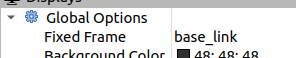
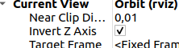
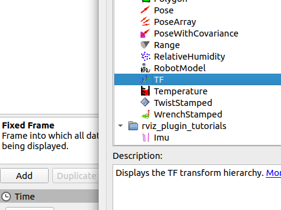
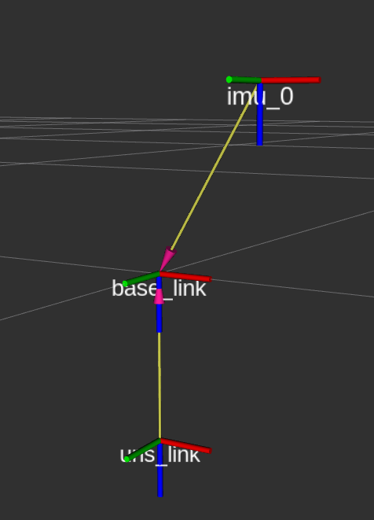
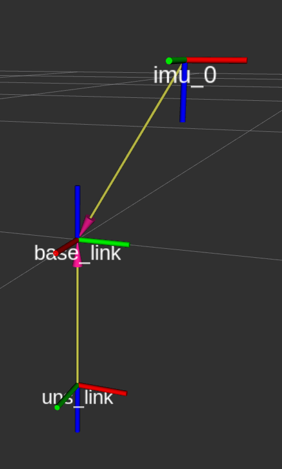
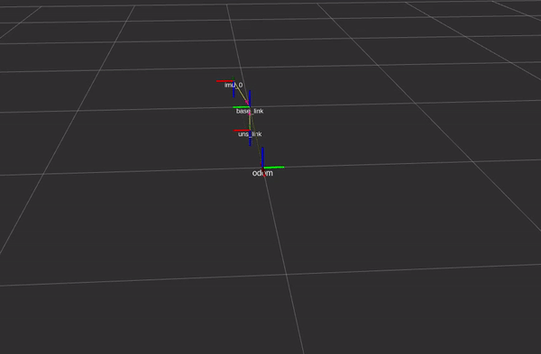

# Frames and coordinate transformation tutorial package

This package aims to give a very basic introduction to coordinate frames and transforms in ROS1, using the tf2 package.

# Preliminaries
This section is meant to be used when using the presentation slides to relate to the ROS implementation.

For notation, we stick with the [REP105 standard](https://www.ros.org/reps/rep-0105.html). Here, the *BODY* frame is referred to as *base_link*, while the world frame is *map* and *odom*. Any vector represented in the *odom* frame is meant to evolve continuously and may drift over time, while vectors in *map* may experience discrete jumps, but should not suffer from drift over time. 

For the current navigation solution of the Vortex AUVs, no external sensors can correct for drift in position, and for that reason, *odom* is the only world frame in question. However, for the ASV, GNSS is available, and as such, both frames may be relevant!

# Task 1: Static transforms
Static transform are coordinate frame transformations between two frames that do not move in relation to one another in time. As such, they can be defined offline using fixed parameters. Examples of such transforms can be the relationship between the chosen body frame of a drone, and the physical locations of all its sensors. The transformation between ENU and NED is also a static transform.

## 1.1 Run the example code

Run the example code by using

    roslaunch frames frames.launch

You should see that multiple `tf2_ros/static_transform_publisher` nodes are launced. You can inspect the tree of transforms using the command

    rosrun tf2_tools view_frames.py

which generates a PDF at the location you ran the command that you can open to see your frames. However, this does obviously not provide a live view. For this we may use RViz:

## 1.2 Use RViz to inspect your frames

Assuming that you still have the nodes from the previous steps runnung, start RViz and set the following settings:

**Fixed  frame = base_link**  
  
This makes the pose of the scene attached to the body frame. 

**Invert Z Axis = checked**  
  
Since we define our frames in accordance with NED, we need this option ticked for things to make physical sense when using NED.

**Add the TF tree**  
  

After fixing your settings and adding the TF object, you will see your frames in RViz. The coloring of the axes are ordered as R, G then B, corresponding to the first, second and third element in the position vector. For NED this will then be:  
* Red: North  
* Green: East  
* Blue: Down  

While rotation about a single axis will correspond to:
* Red: Roll  
* Green: Pitch  
* Blue: Yaw  

However, they are all overlapping. This is because the coordinate transforms as defined in `frames.launch` are all zeros. The actual values for these depends on the physical configuration of the vessel we want to represent. For this example we use the Beluga Mk. 2 AUV.

## 1.3 Define the required static transforms
A static transform is defined in a launchfile as follows:

    <node pkg="tf2_ros"
          type="static_transform_publisher"
          name="name_of_transform"
          args="x y z yaw pitch roll frame_from frame_to" />

In the provided `frames.launch` file there are two static transforms provided: from the body frame to the IMU and DVL.

With the body frame expressed in NED, the IMU is placed 9.4 cm north and 16.0 cm up, while the DVL is placed 14.5 cm down.

Fix the arguments to the transforms in `frames.launch` and visualize the correct frames in RViz. Beware of notations and order of arguments!

Your result should look like this:
  

# Task 2: The endless battle between ENU and NED

So far, all our frames have followed the NED convention, but there exists a strange and twisted breed of human that seems to prefer expressing their lovely little vectors in E...N...U. This makes the author of this text very sad, but at the same time, it is important to be aware of this, especially since ENU is included in the [REP103](https://www.ros.org/reps/rep-0103.html) standard.

It just so happens that the EKF that Vortex NTNU uses - *robot_localization* - expects *base_link* to be expressed in ENU. Going back to the axis color representations, we now have

* Red: East 
* Green: North
* Blue: Up  

While rotation about a single axis will correspond to:
* Red: Pitch  
* Green: Roll 
* Blue: Yaw  

This poses somewhat of an annoyance, since the physical location of the IMU and DVL has not changed, but their transformations to the ENU frame *has*. Your task is to fix the static transforms in `frames.launch` in order to comply with base link in ENU.

When visualizing this in RViz, the Invert Z Axis option should be **unchecked**.

Your result should look like this:
  

# Task 3: Dynamic transforms

So far, the transforms that you have created have been *static*, in the sense that the transformation between frames is independent of time, and is thus expressed as a constant value in a launch file. *Dynamic transforms* are introduced to express the relationship between two frames that evolve in time. For example, the pose estimate of the Beluga AUV can be expressed as a dynamic transformation between the *odom* and *base_link* frames.

The file `dynamic_transforms.py` contains boiler plate code for a dynamic transform, and your goal is to make the *base_link* frame rotate about *odom* in the xy plane, with the forward direction of the *base_link* frame (Green) pointing in the direction of movement.

## 3.1 Define the frame_id's

The `transform` object in the provided python script requires two frames to be specified, namely the `transform.header.frame_id` and the `transform.child_frame_id`, which are the "from" and "to" frames respectively.

Your first task is to define these in the code in accordance to the description above, so that the transformation is from *odom* to *base_link*

## 3.2 Define the translation

Since the body is supposed to move in a circle in the xy plane, the translation vector will be t = [cos(theta), sin(theta), 0].

Define the `transform.transform.translation.?` for x, y and z.

## 3.3 Define the rotation

The rotation component of the `transform` is expressed as a quaternion. Since we are only dealing with yaw when wanting the body to point in the direction of travel in this case, we can use euler angles, converted to a quaternion, to populate the `transform.transform.rotation.?` fields.

Use the function `tf_conversions.transformations.quaternion_from_euler()` to find the quaternion that represents the rotation between *odom* and *base_link* such that *base_link* points in the direction of travel. 

Note that the quaternion convention used by tf2 is xyzw.

Hint: The euler (rpy) representation of the rotation in question is [0, 0, theta], where theta is time-varying.

## 3.4 Broadcast the transform and visualize

You should now have a fully-populated `transform` object, and you can now use the `.sendTransform()` method on the `tf_broadcaster` object in order to publish the transformation.

After this, you may run your code using the `dynamic.launch` file. Note that this file imports the previously defined `frames.launch`, so make sure that you have completed the other tasks beforehand!

Once launched, open RViz once again, set the fixed frame to *odom* and add the TF object. If you have done everything right, you should see that *base_link* is rotating about *odom*, and that the sensor frames are rigidly attached to *base_link*:

  
