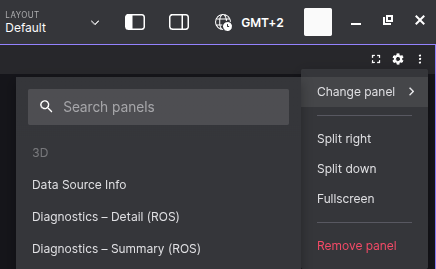
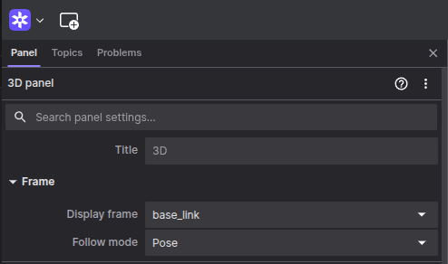
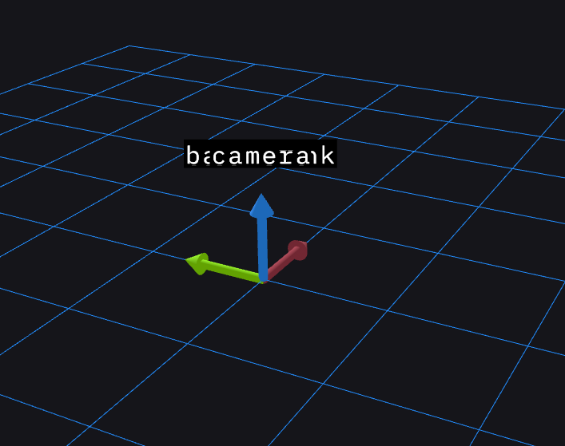
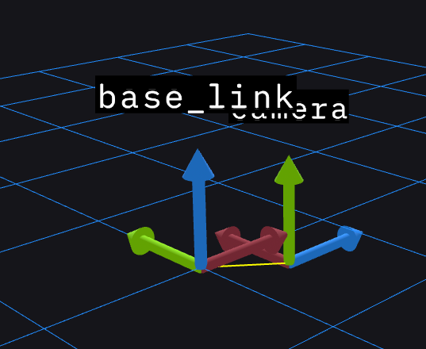
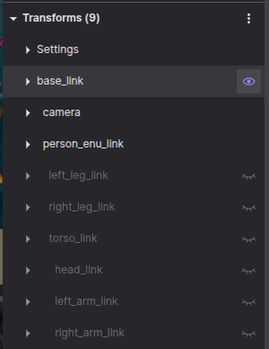
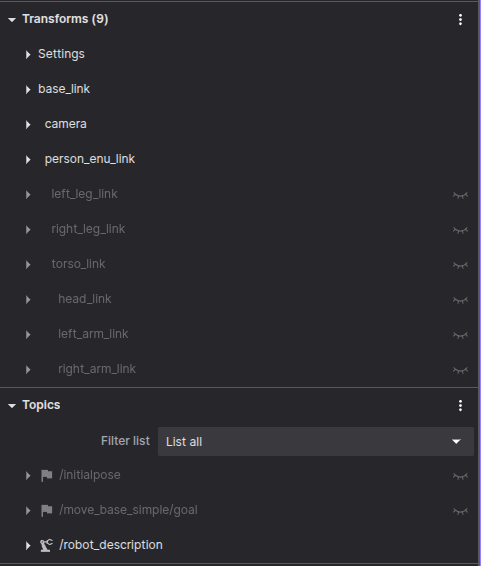
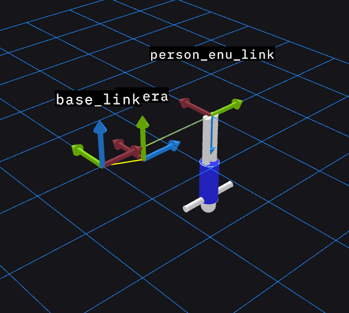
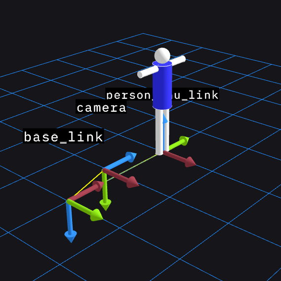
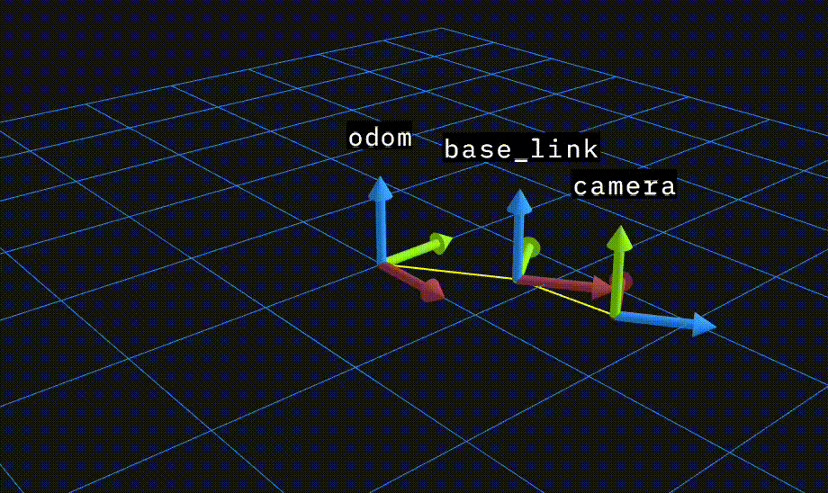
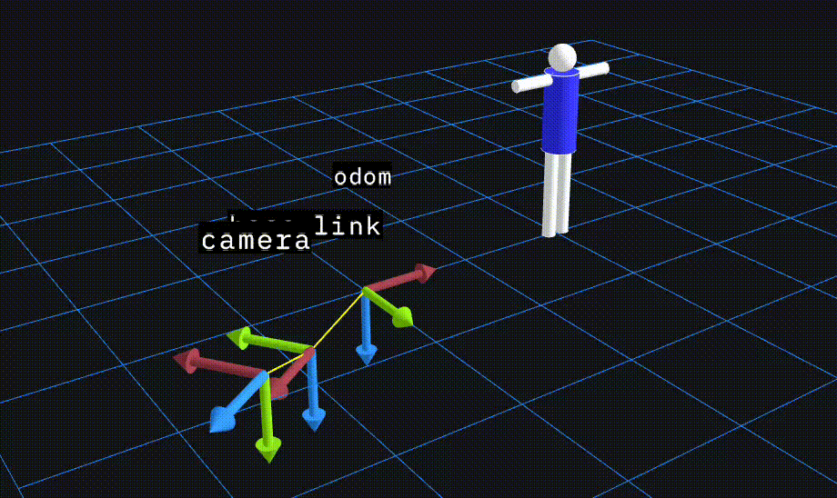

# Frames and Coordinate Transformation Tutorial Package

This package aims to give a very basic introduction to coordinate frames and transforms in ROS2, using the tf2 package. Vortex uses **Foxglove Studio** to visualize topics and ROS 2 data.

# Installing Foxglove for ROS 2 Humble

This guide will walk you through installing Foxglove Studio and the Foxglove Bridge to visualize your ROS 2 Humble data.

**What are Foxglove Studio and Foxglove Bridge?**

* **Foxglove Studio:** A powerful, open-source visualization and debugging tool for robotics data.
* **Foxglove Bridge:** A ROS 2 package that provides a WebSocket server. It allows Foxglove Studio to connect to your live ROS 2 environment, subscribe to topics, and interact with your system.

-----

## Part 1: Install Foxglove Studio

Foxglove Studio is a desktop application. The easiest way to install it on Linux is by downloading the `.deb` file.

1. **Download the Latest Release**  
     Go to the [Foxglove Studio Download page](https://foxglove.dev/download)

2. **Install the `.deb` Package**  
     Find the latest release and download the Debian package file (`.deb`). You can then install it from your terminal.

    ```bash
    # Navigate to your Downloads directory (or wherever you saved the file)
    cd ~/Downloads

    # Replace 'VERSION' with the actual version number you downloaded
    sudo apt install ./foxglove-studio-VERSION-linux-amd64.deb
    ```

    Once installed, you should be able to find "Foxglove Studio" in your applications menu.

-----

## Part 2: Install the Foxglove Bridge

The Foxglove Bridge can be installed easily using `apt`, which is the recommended method.

```bash
sudo apt-get install ros-humble-foxglove-bridge
```

The bridge is now installed and ready to use.

## Part 3: Connect Studio to the Bridge

Now you can run the bridge and connect Foxglove Studio to it.

```bash
ros2 launch foxglove_bridge foxglove_bridge_launch.xml
```

You should see output indicating that the server is listening on a specific port (the default is `8765`).

* Open the Foxglove Studio application.
* Select "Open Connection".
* Select **"Foxglove Bridge"**.
* The default URL (`ws://localhost:8765`) should already be filled in.
* Click **"Open Connection"**.

Foxglove is now ready to use for visualizing ROS 2 data.

# Preliminaries

For notation, we stick with the [REP105 standard](https://www.ros.org/reps/rep-0105.html). Here, the *BODY* frame is referred to as *base_link*, while the world frame is *map* and *odom*. Any vector represented in the *odom* frame is meant to evolve continuously and may drift over time, while vectors in *map* may experience discrete jumps, but should not suffer from drift over time.

For the current navigation solution of the Vortex AUVs, no external sensors can correct for drift in position, and for that reason, *odom* is the only world frame in question. However, for the ASV, GNSS is available, and as such, both frames may be relevant!

# Task 1: Static Transforms

Static transforms are coordinate frame transformations between two frames that do not move in relation to one another in time. As such, they can be defined offline using fixed parameters. Examples of such transforms can be the relationship between the chosen body frame of a drone and the physical locations of all its sensors. The transformation between ENU (East North Up) and NED (North East Down) is also a static transform.

## 1.1 Run the Example Code

Run the example code by using

        ros2 launch frames static_frames.launch.py

You should see that multiple `tf2_ros/static_transform_publisher` nodes are launched when running

        ros2 node list

## 1.2 Use Foxglove to Inspect Your Frames

Assuming that you still have the nodes from the previous steps running, start `foxglove` and the `foxglove_bridge` following the guide above and set the following settings:

To inspect the launched frames, open the 3D panel in Foxglove. Click the `three dots` in the top right corner to bring down the menu. Hover over `Change panel` and select the first option, which is the `3D` panel.

**Open 3D panel**



**Select display frame**  
  
In the left-hand menu accompanied by the 3D panel, select the `base_link` as the display frame.

**View frames**  
  
If everything is set up correctly, you should now be able to inspect the frames in the 3D panel.

The coloring of the axes is ordered as R, G, then B, corresponding to the first, second, and third elements in the position vector. For NED this will then be:  
* Red: North  
* Green: East  
* Blue: Down  

While rotation about a single axis will correspond to:
* Red: Roll  
* Green: Pitch  
* Blue: Yaw  

However, they are all overlapping. This is because the coordinate transforms as defined in `static_frames.launch.py` are all zeros. The actual values for these depend on the physical configuration of the vessel we want to represent. For this tutorial, we use a simplified example from our AUV Orca.

## 1.3 Define the Required Static Transforms

A static transform is defined in a launch file as follows:

```bash
Node(
            package='tf2_ros',
            executable='static_transform_publisher',
            name='base_link_to_camera',
            arguments=['--x', '0', '--y', '0', '--z', '0',
                       '--yaw', '0', '--pitch', '0', '--roll','0',
                       '--frame-id', 'base_link', '--child-frame-id', 'camera'],
        ),
```
In the provided `static_frames.launch.py` file, the static transformation between base_link and a front-facing camera is defined.

The frame convention for camera sensors is x to the right (rows of an image), y pointing down (columns of an image), and that leaves z pointing forwards in order to define a valid right-hand coordinate system.

Although we say that `base_link` follows the NED convention, the first axis x is actually defined to point in the direction the drone is facing. With z pointing down, that means y points to the right from the perspective of the drone.

For this example, we will say that the real-world location of the camera is 0.7m in front of `base_link` and 0.2m above.

To solve this task, you also have to define the rotations between the frames. In the launch file, the rotations are defined by radians. The rotations are extrinsic, applied in the X, Y, Z order. Extrinsic rotations mean that you apply the rotations around the original axis of the parent frame.

Fix the arguments to the transform in `static_frames.launch.py` and visualize the correct frames in Foxglove (Hint: the rotations can be solved first by a rotation around X, followed by a rotation around the Z axis).

Your result should look like this:  


Although the base_link frame uses the NED convention, it looks here like the z-axis is pointing upwards. This is just because we don't have anything else to compare it against.

# Task 2: The Endless Battle Between ENU and NED

So far, all our frames have followed the NED convention, but there exists a strange and twisted breed of human that seems to prefer expressing their lovely little vectors in E...N...U. This makes the author of this text very sad, but at the same time, it is important to be aware of this, especially since ENU is included in the [REP103](https://www.ros.org/reps/rep-0103.html) standard.

We will introduce a short example to help understand the different conventions.

A prerequisite for this task is to install the xacro package for ROS2 Humble:

        sudo apt-get install ros-humble-xacro

While still running the previous launch file `static_frames.launch.py`, launch the example file

        ros2 launch frames person.launch.py

This will launch a simple person model and its corresponding frames. Not all these are needed, so uncheck the frames we don't care about. Click the eye to toggle the visualization of frames.

For this example, only `person_enu_link`, `base_link`, and `camera` are needed.


Under the topics tab, toggle the `/robot_description` topic at the bottom to visualize our person model.


With `base_link` still selected as the `display frame`, your 3D panel should look like this:


Now that we have an object defined using the ENU convention, we can finally see that our `base_link` is actually defined with Z-down as according to the NED convention.

Obviously, visualizing things upside down is not always preferred. To fix this, select `person_enu_link` as the `display frame`.

Your 3D panel should no longer visualize your person upside down.


This example highlights that one consequence of using the NED convention is that things will be visualized upside down. A simple fix for this is to define a new visualization frame attached to the world frame that has its z-axis pointing upwards.

# Task 3: Dynamic Transforms

So far, the transforms that you have created have been *static*, in the sense that the transformation between frames is independent of time and is thus expressed as a constant value in a launch file. *Dynamic transforms* are introduced to express the relationship between two frames that evolve in time. For example, the pose estimate of the Orca AUV can be expressed as a dynamic transformation between the *odom* and *base_link* frames.

The file `src/dynamic_transform_publisher_ros.cpp` contains boilerplate code for a dynamic transform, and your goal is to make the *base_link* frame rotate about *odom* in the xy plane, with the forward direction of the *base_link* frame (red) pointing in the direction of movement.

## 3.1 Define the frame_id's

The `transform` object in the provided cpp file requires two frames to be specified, namely the `transform.header.frame_id` and the `transform.child_frame_id`, which are the "from" and "to" frames respectively.

Your first task is to define these in the code in accordance with the description above, so that the transformation is from *odom* to *base_link*.

## 3.2 Define the Translation

Since the body is supposed to move in a circle in the xy plane, the translation vector will be cos(theta), sin(theta), and 0.

Define the `transform.transform.translation.?` for x, y, and z.

## 3.3 Define the Rotation

The rotation component of the `transform` is expressed as a quaternion. Since we are only dealing with yaw when wanting the body to point in the direction of travel in this case, we can use Euler angles, converted to a quaternion, to populate the `transform.transform.rotation.?` fields.

Construct a tf2::Quaternion object like `tf2::Quaternion q`, then call `q.setRPY(roll, pitch, yaw)` on the constructed object to find the quaternion that represents the rotation between *odom* and *base_link* such that *base_link* points in the direction of travel.

The elements of the quaternion object can be queried using

`q.x()`

`q.y()`

`q.z()`

`q.w()`

Note that the quaternion convention used by tf2 is xyzw.

Hint: The Euler (RPY) representation of the rotation in question is [0, 0, theta], where theta is time-varying.

## 3.4 Broadcast the Transform and Visualize

You should now have a fully-populated `transform` object, and you can now use the `sendTransform()` method on the `tf_broadcaster` object in order to publish the transformation.

After this, you may run your code using the `dynamic.launch` file. Note that this file imports the previously defined `frames.launch`, so make sure that you have completed the other tasks beforehand!

Once launched, open Foxglove once again, set the display frame to *odom*. If you have done everything right, you should see that *base_link* is rotating about *odom*, and that the camera frame is rigidly attached to *base_link*:



As a final touch, we can edit the transform for the person object. Go into the `person.launch.py` file and change the parent of the transform to odom. Select `person_enu_link` as the display frame to use it as a Z-up visualization frame.


