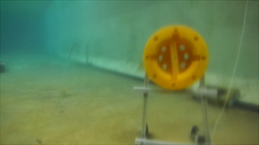
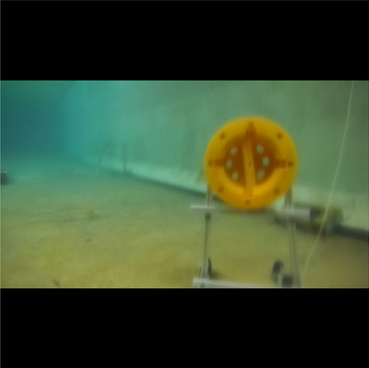
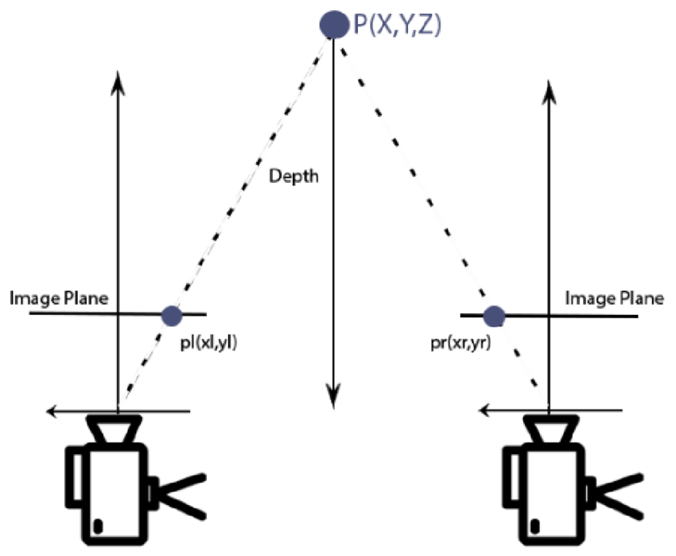
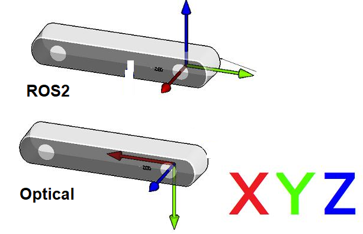

# Object Detection Example

This package is meant to familiarize the user with various relevant concepts and datatypes for the perception/object detection workflow.

Things covered in this example:

- Bounding Boxes  
- Camera Matrices  
- Stereo Cameras  
- OpenCV  
- PointCloud Library  

# Prerequisites  

The rosbag that goes along with this example contains the relevant ros2 topic needed to complete this tutorial. Verify the contents of the rosbag by displaying the color image.  

The `vision-msgs` package required for the `Detection2DArray` (bounding boxes) is not part of the base ROS 2 installation and therefore has to be installed manually:

```bash
sudo apt install ros-<ros2_distro>-vision-msgs
```

Once everything is set up we are ready to start the tutorial.

## Task 1.1 — Republish the color image
ROS 2 uses the [`sensor_msgs/msg/Image`](https://docs.ros2.org/foxy/api/sensor_msgs/msg/Image.html) message definition for images.  
To process these images in OpenCV, convert them to an `cv::Mat` using `cv_bridge`.  
If you want to publish the processed image, convert it back to the ROS 2 `Image` message (again via `cv_bridge`) before publishing.

**Goal:**  
Create a ROS 2 node that:
1. Subscribes to the color image topic (e.g., `/camera/color/image_raw`).
2. Converts each message to an OpenCV `cv::Mat` (`cv_bridge`).
3. Converts it back to `sensor_msgs/msg/Image`.
4. Republishes on a new topic (e.g., `/camera/color/image_repub`).

**Verify with Foxglove Studio**

## Task 1.2 — Visualize the bounding boxes
In this example, bounding boxes come from YOLOv8 detections and are published as
[`vision_msgs/Detection2DArray`](https://docs.ros.org/en/kinetic/api/vision_msgs/html/msg/Detection2DArray.html).
Each detection uses a [`vision_msgs/BoundingBox2D`](https://docs.ros.org/en/kinetic/api/vision_msgs/html/msg/BoundingBox2D.html),
whose relevant fields (pixel coordinates, stored as floats for sub-pixel precision) are:

- `center.x`
- `center.y`
- `size_x`
- `size_y`

This is enough information to draw rectangles on the color image.

We’ve provided a helper function `draw_bounding_boxes` in `src/bounding_box_utils.cpp`.
Check `include/types.hpp` for helper structs. It’s good practice to convert ROS types to
non-ROS types before processing.

**Goal:**
1. Subscribe to the color image topic and the `Detection2DArray` topic.
2. Convert the image to `cv::Mat` (`cv_bridge`), convert detections into your helper structs.
3. Call `draw_bounding_boxes` to overlay rectangles on the image.
4. Publish the annotated image as a ROS 2 `sensor_msgs/msg/Image` on a new topic (e.g., `/image_with_boxes`).

> You may notice the boxes appear slightly misaligned. That’s expected for now and leads into the next task.

**Verify with Foxglove Studio:**

## Task 1.3 — Transforming the bounding boxes

**Why the initial boxes look off:**  
YOLO models expect 640×640 images. Your camera frames rarely match this shape. To avoid distortion, the input image is resized while **preserving aspect ratio**, and the empty space is filled with padding (“letterbox”).  
As a result, the bounding boxes you get back are in the **letterboxed coordinate system**, not in the original camera image coordinates.

To overlay boxes correctly, we must transform them back.

---

## Visual comparison

| Original frame | Letterboxed (640×640) |
|----------------|------------------------|
|  |  |

---

## How to fix the coordinates

1. **Know both dimensions**  
   - Original image size: available in the [`sensor_msgs/msg/Image`](https://docs.ros2.org/foxy/api/sensor_msgs/msg/Image.html) header (`height`, `width`), or more formally from the [`sensor_msgs/msg/CameraInfo`](https://docs.ros2.org/latest/api/sensor_msgs/msg/CameraInfo.html).  
   - Letterbox size: always **640×640** for this YOLO model.

2. **Compute scale and padding**  
   - Determine the scaling factor that was applied when resizing the original image to fit 640×640.  
   - Compute the horizontal or vertical padding that was added to center the image in the square.

3. **Undo the letterbox transform**  
   For each YOLO box `(cx, cy, w, h)` in letterbox coordinates:
   - Subtract the padding (x/y offset).  
   - Divide by the scale factor.  
   - You now have the box in the original camera image coordinates.

4. **Publish corrected results**  
   - Use the provided functions in `src/bounding_box_utils.cpp` to handle these transforms.  
   - Then redraw and republish the adjusted bounding boxes.

---

## Implementation hint

- Subscribe to `/camera/color/image_raw` (or similar) and `/camera/color/camera_info`.  
- Store `height` and `width` from the camera info in member variables.  
- Apply the transform using the helper functions in `bounding_box_utils.cpp`.  

---

**Verify with Foxglove Studio:**  

# Task 2 — From Depth Image to PointCloud

The rosbag also includes a **depth image** produced by a ZED2 stereo camera.  
Each pixel in the depth image is a `float32` value representing the distance along the **z-axis (camera forward direction)** for that pixel.

---

## Stereo camera basics



Stereo cameras capture two images of the same scene from slightly different viewpoints, similar to human vision.  
By comparing these images, the system calculates pixel disparities, which can be converted into distances. This allows **depth perception** and **3D reconstruction** of the environment.  

The internal details of how the ZED2 calculates disparity and depth are outside the scope of this tutorial.

For this dataset:
- The depth image is **aligned with the left color image**.  
- The color and depth frames are **synchronized**, making it straightforward to fuse them.

---

## Camera matrix

Depth images can have different resolutions and fields of view. To map depth pixels into 3D space, we need a model of the camera — the **camera matrix**.  

- In ROS 2, the **optical frame convention** is:  
  - **x → right**  
  - **y → down**  
  - **z → forward**



Note:  
- The “optical” frame (above) is the relevant one here.  
- Cameras may also be described with other frame conventions (e.g., x-forward, y-left, z-up).  
- In maritime robotics, a z-down convention is common — be aware of these differences to avoid confusion.

If you’re new to camera matrices, this short video is a great primer:  
[Camera Calibration and Projection (YouTube)](https://www.youtube.com/watch?v=Hz8kz5aeQ44)

The camera matrix for the color image is provided on the `/camera_info` topic.  
Since the color and depth images are aligned, **you can use the color camera matrix for both**.

---

## From depth to 3D points

We’ve provided a utility function to convert depth pixels into 3D points using the camera matrix.

When dealing with large sets of 3D data, it’s common to use the **Point Cloud Library (PCL)**, which provides efficient data structures and algorithms for working with point clouds.

---

## Your task

1. **Subscribe** to:  
   - The color image  
   - The depth image  
   - The camera info  

2. **Combine data**:  
   - Use bounding boxes from Task 1  
   - For each pixel **inside a bounding box**, read the corresponding depth value  
   - Convert the pixel (u, v, depth) into a 3D point (x, y, z) using the camera matrix  

3. **Publish as a point cloud**:  
   - Represent your set of 3D points in ROS 2 as a [`sensor_msgs/msg/PointCloud2`](https://docs.ros.org/en/noetic/api/sensor_msgs/html/msg/PointCloud2.html).  
   - Use the `pcl_conversions` package to convert between ROS 2 messages and PCL data structures.  

---

**Verify with Foxglove Studio**  
